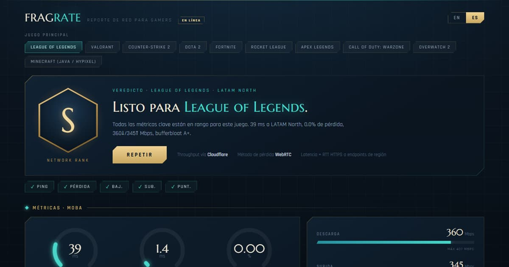

# ⚡ FRAGRATE — Gamer Network Report

A **gamer-grade** network quality report. Not another "download / upload" speed test —
FRAGRATE measures the metrics that actually decide whether you can play: **ping to real
game regions, jitter, packet loss, and bufferbloat (latency under load)** — then gives you
a straight, per-game verdict: **PLAYABLE / RISKY / NO-GO**.



## Why it's different

`fast.com` and most speed tests answer "how big is your pipe?". Gamers care about a
different question: **"will my shots register and will I rubber-band?"** That's governed by
latency, its stability (jitter), packet loss, and what happens to latency when the link is
busy (bufferbloat) — none of which a throughput number captures.

FRAGRATE scores your connection against **per-genre thresholds** (a tactical shooter is far
less forgiving than an MMO) and tells you, game by game, whether you're good to go.

## Honest by design

Every metric is measured from the vantage point that makes it truthful — and every number
is labeled with how it was obtained:

| Metric | How it's measured | Why |
|---|---|---|
| **Ping / jitter** (per region) | Server-side **TCP-connect handshake** from *your* machine to the public cloud region each game hosts in | Root-free, confirms reachability, and reflects your real path to that metro. Labeled "TCP handshake", not "ping". |
| **Packet loss + UDP jitter** | Server-side **STUN binding requests over UDP** to public STUN servers | Real internet UDP loss from your link — the thing that actually causes in-game packet loss. (TCP can't see loss; it retransmits.) |
| **Download / upload** | Browser ↔ **Cloudflare's public speed endpoints** | Measures your real internet path. Measuring against the local server would only test the loopback. Falls back to a local-loopback test (clearly labeled) if Cloudflare is unreachable. |
| **Bufferbloat** | Latency probes taken *while* the link is saturated, vs. idle | The single most underrated gamer metric — a fat pipe with bad bufferbloat still lag-spikes the moment someone streams Netflix. |

> Most game servers run UDP-only and refuse TCP, so the per-region endpoints are **cloud-region
> geographic proxies** (the AWS/GCP region co-located with the real game datacenter). This is
> disclosed in the UI. Two real TCP gameservers (Minecraft Java — Hypixel, CubeCraft) are probed directly.

Because the Node server runs **on your own machine**, its TCP/UDP probes originate from *your*
connection — so they measure your real path, not some datacenter's.

## The verdict & rank

A weighted score (latency + jitter + loss = 85%, throughput = 15%, with a bufferbloat penalty
and hard caps for unplayable loss/ping/jitter) rolls up into a gamer **rank S → F**, and each
game in the catalog gets a **PLAYABLE / RISKY / NO-GO** verdict using *its own* genre's
thresholds. Switch your primary game or region and the verdicts recompute instantly from the
data already collected — no re-test needed.

## Run it

> **Prereqs:** Node 20+ and pnpm 10+ — both pinned (`.nvmrc`, the `packageManager` field).
> Run `corepack enable` once and the pinned pnpm is provisioned automatically.

```bash
pnpm install
pnpm dev         # client on http://localhost:5173 (proxies to the server on :8787)
```

Open http://localhost:5173, pick your game, and hit **RUN TEST**.

Production (single origin, server serves the built client):

```bash
pnpm build
pnpm start       # http://localhost:8787
```

Other scripts: `pnpm typecheck` (both workspaces).

> Monorepo via **pnpm** workspaces (`pnpm-workspace.yaml`): the `client` and `server`
> packages, plus a path-aliased `shared/` (imported as `@shared/*`, not a workspace).

## Deploy to Cloudflare Pages (hosted mode)

FRAGRATE runs in two modes, detected automatically at load:

- **Local mode** (you run it on your machine): full report — real per-game-region TCP ping + STUN/UDP packet loss measured from *your* connection.
- **Hosted mode** (static on Cloudflare Pages): browser-only — download, upload, bufferbloat, and **packet loss via WebRTC through Cloudflare's TURN relay**. Per-game-region ping becomes a *"run locally"* feature (a browser can't do raw TCP/UDP to game servers). The hosted site shows a **Hosted demo** badge and a run-locally panel where the region map would be.

Everything deploys to Cloudflare — no Vercel, no VPS:

- **Static client** → Cloudflare Pages (build `pnpm build`, output `client/dist`).
- **TURN credentials** → a Pages Function at `functions/api/turn.ts` (`/api/turn`) that mints short-lived Cloudflare Realtime TURN credentials. The long-term key stays server-side.

### One-time setup

1. **Create a TURN key**: Cloudflare dashboard → **Realtime (Calls) → TURN** (`dash.cloudflare.com/?to=/:account/calls`) → *Create TURN key*. Copy both values immediately — the API token is shown only once.
2. **Create the Pages project**: Workers & Pages → Create → Pages → connect this repo (or `wrangler pages deploy`). Build command `pnpm build`, output `client/dist`, root directory blank. The repo's `.nvmrc` pins **Node 20** for the build, and Cloudflare auto-detects pnpm from the committed `pnpm-lock.yaml` + the `packageManager` field — no extra config needed.
3. **Add the two secrets** (Settings → Variables and Secrets → type *Secret*, for Production):
   - `TURN_KEY_ID`
   - `TURN_KEY_API_TOKEN`
   
   …or via CLI: `pnpm dlx wrangler pages secret put TURN_KEY_ID` / `... TURN_KEY_API_TOKEN`.
4. **Custom domain**: Pages project → Custom domains → add your apex/subdomain → Activate. Let Cloudflare create the DNS record (don't pre-create a CNAME, or you'll get a 522).
5. **Verify**: open `https://<project>.pages.dev/api/turn` → expect `200` with an `iceServers` array. A `500` means the secrets aren't set. Then run the report and confirm the packet-loss gauge populates.

Config lives in `wrangler.jsonc` (`pages_build_output_dir: ./client/dist`). For local Pages dev, put the two keys in a gitignored `.dev.vars` and run `pnpm build && pnpm dlx wrangler pages dev client/dist`. Without TURN configured, the hosted site still works — packet loss just shows as "run locally" rather than breaking.

## Architecture

```
shared/      Types + game catalog + genre thresholds + grading math + WS protocol
             (single source of truth, imported by both client and server)
server/      Node + ws. Thin measurement plane: /dl, /ul, TCP region pinger,
             STUN UDP loss prober, WebSocket session (/net). Runs via tsx.
client/      Vite + React + TS. Measurement engine (Cloudflare throughput,
             bufferbloat, orchestration, grading) + neon-cyberpunk dashboard.
docs/        BUILD_SPEC.md, MEASUREMENT_ENGINE.md
```

- **Stack:** Node 20+, no native dependencies. Client is dependency-light (React only; the
  neon HUD, SVG gauges and canvas sparkline are hand-built CSS/SVG/Canvas).
- **Latency** = `performance.now()` / `process.hrtime.bigint()`; throughput is **base-10 Mbps
  from wire bytes**, matching ISP marketing numbers.

## Caveats

- Per-region latency is most accurate when the server runs **locally** (the default). Deploying
  the server remotely would make region pings reflect the *server's* location, not yours.
- The region endpoints are cloud-region proxies, not literal game-server IPs (see above).
- Packet loss requires outbound UDP to public STUN servers; if your network blocks it, loss is
  reported as unavailable rather than guessed.
